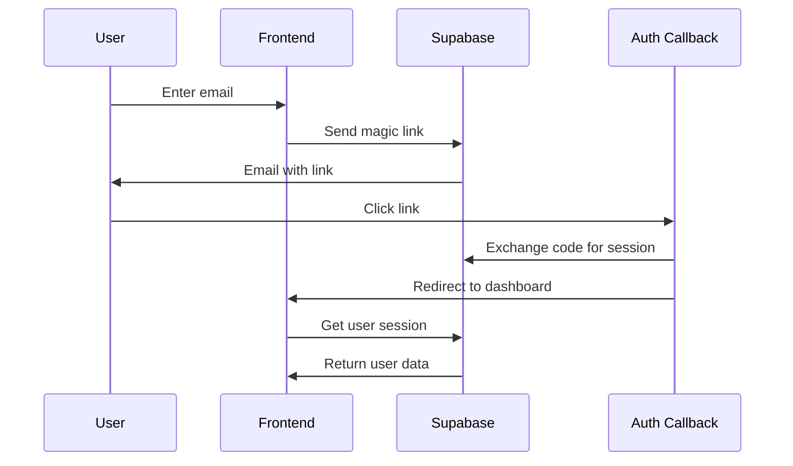
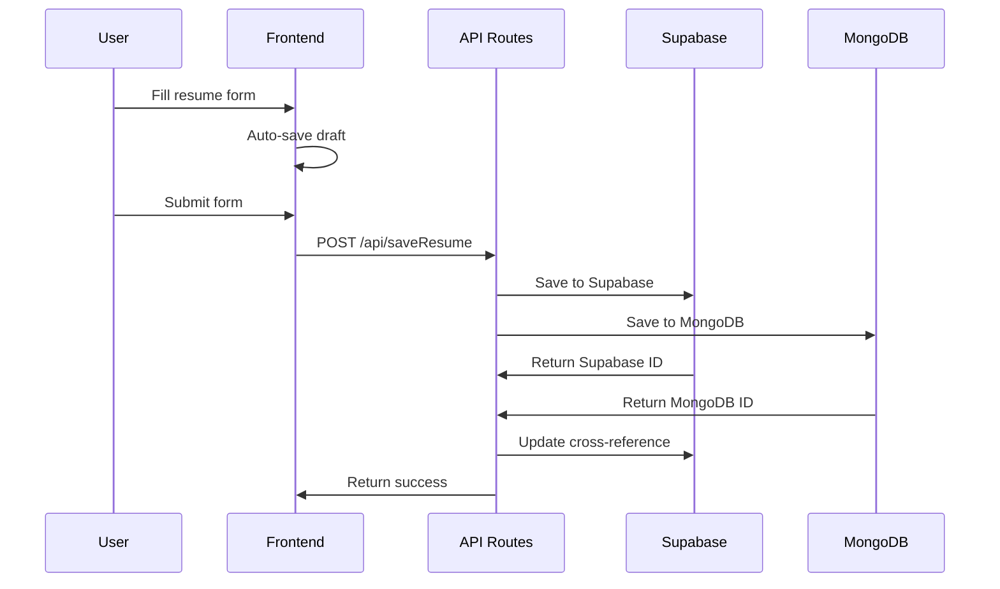
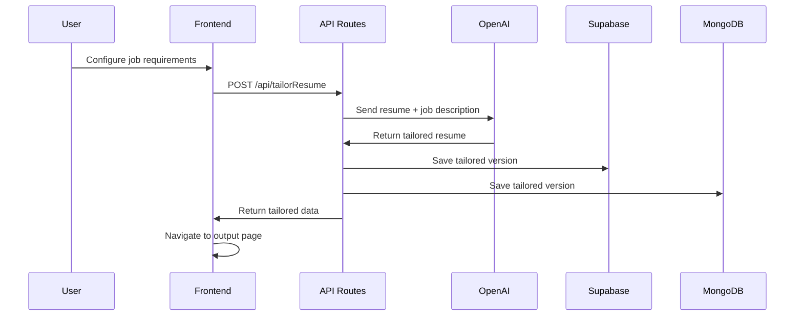

# 🏗 System Architecture

## Overview

The AI-Powered Resume Tailor is built as a modern web application using Next.js 15 with the App Router, featuring a dual-database architecture for robust data management and AI-powered resume optimization.

## 🏛 High-Level Architecture

```
┌─────────────────────────────────────────────────────────────────┐
│                        Client Layer                            │
│  ┌─────────────┐  ┌─────────────┐  ┌─────────────┐          │
│  │   React     │  │ TypeScript  │  │ Tailwind    │          │
│  │ Components  │  │   Types     │  │    CSS      │          │
│  └─────────────┘  └─────────────┘  └─────────────┘          │
└─────────────────────────────────────────────────────────────────┘
                                │
                                ▼
┌─────────────────────────────────────────────────────────────────┐
│                     Next.js App Router                        │
│  ┌─────────────┐  ┌─────────────┐  ┌─────────────┐          │
│  │   Pages     │  │ API Routes  │  │ Middleware  │          │
│  │ (Client)    │  │ (Server)    │  │ (Server)    │          │
│  └─────────────┘  └─────────────┘  └─────────────┘          │
└─────────────────────────────────────────────────────────────────┘
                                │
                                ▼
┌─────────────────────────────────────────────────────────────────┐
│                    Service Layer                              │
│  ┌─────────────┐  ┌─────────────┐  ┌─────────────┐          │
│  │  Supabase   │  │   MongoDB   │  │   OpenAI    │          │
│  │   Client    │  │   Client    │  │    API      │          │
│  └─────────────┘  └─────────────┘  └─────────────┘          │
└─────────────────────────────────────────────────────────────────┘
                                │
                                ▼
┌─────────────────────────────────────────────────────────────────┐
│                    Data Layer                                 │
│  ┌─────────────┐  ┌─────────────┐  ┌─────────────┐          │
│  │  Supabase   │  │   MongoDB   │  │   External  │          │
│  │ PostgreSQL  │  │   Atlas     │  │    APIs     │          │
│  └─────────────┘  └─────────────┘  └─────────────┘          │
└─────────────────────────────────────────────────────────────────┘
```

## 🔄 Data Flow

### 1. Authentication Flow



### 2. Resume Creation Flow



### 3. AI Tailoring Flow



## 🗄 Database Design

### Supabase (PostgreSQL)

#### `resumes` Table
```sql
CREATE TABLE resumes (
  id UUID DEFAULT gen_random_uuid() PRIMARY KEY,
  user_id UUID REFERENCES auth.users(id),
  title TEXT NOT NULL,
  content JSONB NOT NULL,
  created_at TIMESTAMP WITH TIME ZONE DEFAULT NOW(),
  updated_at TIMESTAMP WITH TIME ZONE DEFAULT NOW(),
  mongo_id TEXT
);
```

#### `history` Table
```sql
CREATE TABLE history (
  id UUID DEFAULT gen_random_uuid() PRIMARY KEY,
  user_id UUID REFERENCES auth.users(id),
  resume_id UUID REFERENCES resumes(id),
  action TEXT NOT NULL,
  timestamp TIMESTAMP WITH TIME ZONE DEFAULT NOW()
);
```

### MongoDB

#### `resumes` Collection
```javascript
{
  _id: ObjectId,
  supabase_id: String,
  user_id: String,
  title: String,
  content: {
    personal: Object,
    experience: Array,
    education: Array,
    skills: Object
  },
  created_at: Date,
  updated_at: Date
}
```

## 🔐 Security Architecture

### Authentication
- **Magic Link Authentication**: Email-based, passwordless authentication
- **Session Management**: Automatic session handling with Supabase
- **Row Level Security (RLS)**: Database-level access control

### Authorization
```sql
-- Users can only access their own data
CREATE POLICY "Users can view own resumes" ON resumes
  FOR SELECT USING (auth.uid() = user_id);
```

### Data Protection
- **Environment Variables**: Sensitive data stored in environment variables
- **HTTPS**: All communications encrypted
- **Input Validation**: Server-side validation for all inputs

## 🎨 Frontend Architecture

### Component Structure

```
src/
├── app/
│   ├── components/           # Shared components
│   │   ├── ui/             # UI primitives
│   │   └── forms/          # Form components
│   ├── lib/                # Utilities and helpers
│   │   ├── auth-context.tsx
│   │   ├── mongodb.ts
│   │   └── utils.ts
│   └── app/                # App Router pages
│       ├── (auth)/         # Authentication pages
│       ├── (dashboard)/    # Protected pages
│       └── api/            # API routes
```

### State Management
- **React Context**: Global theme and authentication state
- **Local State**: Component-specific state with useState
- **LocalStorage**: Client-side data persistence
- **Server State**: API data fetching and caching

### Styling Architecture
- **Tailwind CSS**: Utility-first styling
- **Dark Mode**: CSS custom properties for theme switching
- **Responsive Design**: Mobile-first approach
- **Component Library**: Reusable UI components

## 🔧 Backend Architecture

### API Routes Structure

```
src/app/api/
├── saveResume/
│   └── route.ts            # POST - Save resume
├── getResumes/
│   └── route.ts            # GET - Fetch resumes
├── deleteResume/
│   └── route.ts            # DELETE - Delete resume
├── tailorResume/
│   └── route.ts            # POST - AI tailoring
├── saveHistory/
│   └── route.ts            # POST - Save history
└── getHistory/
    └── route.ts            # GET - Fetch history
```

### Database Integration

#### Supabase Client
```typescript
import { createClient } from '@supabase/supabase-js'

const supabase = createClient(
  process.env.NEXT_PUBLIC_SUPABASE_URL!,
  process.env.NEXT_PUBLIC_SUPABASE_ANON_KEY!
)
```

#### MongoDB Client
```typescript
import { MongoClient } from 'mongodb'

const client = new MongoClient(process.env.MONGODB_URI!)

async function connectToMongoDB() {
  try {
    await client.connect()
    return client.db('resume-tailor')
  } catch (error) {
    console.error('MongoDB connection error:', error)
    throw error
  }
}
```

### AI Integration

#### OpenAI Integration
```typescript
import OpenAI from 'openai'

const openai = new OpenAI({
  apiKey: process.env.OPENAI_API_KEY,
})

async function tailorResume(resumeData: any, jobDescription: string) {
  const completion = await openai.chat.completions.create({
    model: "gpt-3.5-turbo",
    messages: [
      {
        role: "system",
        content: "You are an expert resume writer..."
      },
      {
        role: "user",
        content: `Resume: ${JSON.stringify(resumeData)}\nJob: ${jobDescription}`
      }
    ]
  })
  
  return completion.choices[0].message.content
}
```

## 🚀 Performance Considerations

### Frontend Optimization
- **Code Splitting**: Automatic with Next.js App Router
- **Image Optimization**: Next.js Image component
- **Bundle Analysis**: Built-in bundle analyzer
- **Caching**: Static generation where possible

### Backend Optimization
- **Database Indexing**: Proper indexes on frequently queried fields
- **Connection Pooling**: Efficient database connections
- **Caching**: Redis for frequently accessed data (future)
- **CDN**: Static asset delivery

### AI Optimization
- **Request Batching**: Batch AI requests where possible
- **Response Caching**: Cache AI responses for similar requests
- **Rate Limiting**: Prevent API abuse
- **Error Handling**: Graceful degradation

## 🔄 Deployment Architecture

### Development Environment
```
Local Development
├── Next.js Dev Server (localhost:3000)
├── Supabase (Development Project)
├── MongoDB Atlas (Development Cluster)
└── OpenAI API (Development Key)
```

### Production Environment
```
Vercel Deployment
├── Next.js Production Build
├── Supabase (Production Project)
├── MongoDB Atlas (Production Cluster)
├── OpenAI API (Production Key)
└── CDN (Static Assets)
```

## 📊 Monitoring and Logging

### Application Monitoring
- **Error Tracking**: Console logging and error boundaries
- **Performance Monitoring**: Built-in Next.js analytics
- **User Analytics**: Page views and interactions
- **API Monitoring**: Response times and error rates

### Database Monitoring
- **Supabase Dashboard**: Built-in monitoring
- **MongoDB Atlas**: Cloud monitoring
- **Query Performance**: Slow query detection
- **Connection Health**: Connection pool monitoring

## 🔮 Future Enhancements

### Planned Features
- **Real-time Collaboration**: Multiple users editing
- **Template System**: Pre-built resume templates
- **Advanced AI**: More sophisticated tailoring algorithms
- **Analytics Dashboard**: Resume performance tracking

### Technical Improvements
- **Microservices**: Break down into smaller services
- **GraphQL**: More efficient data fetching
- **WebSocket**: Real-time updates
- **Redis**: Caching layer

## 🛡 Security Best Practices

### Data Protection
- **Encryption**: Data encrypted in transit and at rest
- **Backup**: Regular database backups
- **Access Control**: Principle of least privilege
- **Audit Logging**: Track all data access

### Application Security
- **Input Sanitization**: Prevent injection attacks
- **CORS**: Proper cross-origin resource sharing
- **Rate Limiting**: Prevent abuse
- **Security Headers**: HTTPS and security headers

---

This architecture provides a solid foundation for a scalable, secure, and maintainable AI-powered resume tailoring application. 